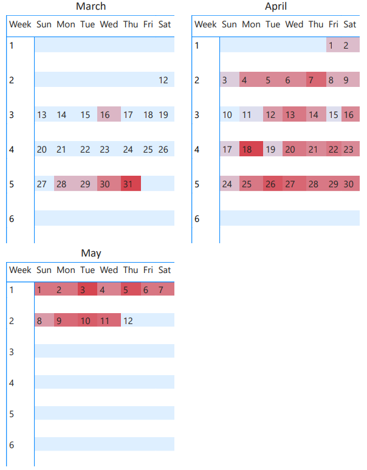

# 1. Introduction
Bellabeat is a company that manufactures health-tracking smart products for women, things like the Leaf (wellness tracker), Time (smart watch), Spring (hydration tracker), and the Bellabeat app (activity, sleep, and mindfulness tracking). Founded in 2013 by Urška Sršen and Sando Mur, it positions itself as a lifestyle brand that helps women understand their own health data and build sustainable habits, not just chase step counts.

# 2. Purpose of Analysis
The purpose of this analysis is to understand Bellabeat's current customer behavior and split it into 3 clusters, so the marketing team knows which cluster has the highest chance of converting to a paid membership.

The idea: instead of guessing, we use peer reviewed research to figure out what kind of user is most likely to stick with a health app long term. Then we find which of our clusters matches that profile. In plain terms, we find the group of users most likely to actually become paying members, and back it up with published studies rather than gut feeling.

# 3. Data & Methodology

## 3.1 Dataset used
The data source used in this case study is Fitbit Fitness Tracker Data from file Fitabase Data 3.12.16-4.11.16 and merged with Fitabase Data 4.12.16-5.12.16

## 3.2 Information of the dataset
These datasets were generated by respondents to a distributed survey via Amazon Mechanical Turk between 03.12.2016-05.12.2016. Thirty eligible Fitbit users consented to the submission of personal tracker data, including minute-level output for physical activity, heart rate, and sleep monitoring. Individual reports can be parsed by export session ID (column A) or timestamp (column B). Variation between output represents use of different types of Fitbit trackers and individual tracking behaviors / preferences.

## 3.3 Preparing
For the packages I use tidyverse for the ggplot2, dplyr, readr, and factoextra for the K-means capabilities.
For the dataset I merged Fitabase Data 3.12.16-4.11.16 and Fitabase Data 4.12.16-5.12.16 with both being dailyactivity.csv

`set.seed()` is fixed globally so every knit of this notebook produces the exact same clustering result, and the data loading chunk is cached so the CSVs are not re read on every rerun.

```{r setup, cache=TRUE, message=FALSE, warning=FALSE}
library(tidyverse)
library(snakecase)
library(janitor)
library(factoextra)

set.seed(1234)

# One palette, defined once in setup, reused in every plot chunk.
# Keyed by the semantic labels so colours never shuffle between reruns.
cluster_colors <- c(
  "Consistent High Activity" = "#E41A1C",
  "Inconsistent User" = "#4DAF4A",
  "Consistent Low Activity" = "#377EB8"
)

master_activity_raw <- c(
  list.files(path="Fitabase Data 3.12.16-4.11.16", pattern = "dailyActivity", full.names = TRUE),
  list.files(path="Fitabase Data 4.12.16-5.12.16", pattern = "dailyActivity", full.names = TRUE)
) %>% 
  lapply(read_csv, show_col_types = FALSE) %>% 
  bind_rows()
```

Preview of `master_activity_raw`
```{r preview}
head(master_activity_raw, 5)
```

## 3.4 Methodology
- Creating unsupervised cluster segmentation based on criterion that is justified with peer reviewed paper

### 3.4.1 Justification source
- Higher training frequency showed longer engagement [https://doi.org/10.21037/mhealth-25-15]
- The study suggests that consistency, more than sheer intensity, helps turn tracker use into a long-term habit. [doi:10.2196/22488]
- Intensity level: Moderate - Vigorous / very active will be counted as exercise based on [Activity Levels Explained: Complete Classification Guide. (2026). Free Calculator Hub.]

### 3.4.2 Limitation
- Self selected cohort, all user chose to share data, bias toward already engaged
- tiny sample of 35 users

# 4. Processing
## 4.1 Cleaning
This chunk always rebuilds `master_activity` from `master_activity_raw`, so it is idempotent it can be rerun any number of times and always produces the same result. Column names are cleaned first, then the `date` and `weekday` columns are created, and duplicates are removed.
```{r cleaning}
master_activity <- master_activity_raw %>% 
  clean_names() %>% 
  mutate(
    date = mdy(activity_date),
    weekday = wday(date, label = TRUE, abbr = FALSE)
  ) %>% 
  distinct()

# For new column preview
master_activity %>% select(id, date, weekday) %>% head(3)
```

Checking any NA
```{r}
colSums(is.na(master_activity))
```
No NA's recorded

# 5. Analyzing data
Creating master table and proceeding with K-Mean model

## 5.1 Creating master table
I picked these columns because they will be used as a criterion for upcoming analysis.
```{r master-table}
master_activity_analysis <- master_activity %>%
  select(
    id, date, weekday,
    total_steps,
    calories,
    very_active_minutes,
    fairly_active_minutes,
    very_active_distance,
    moderately_active_distance
  )
```

## 5.2 Criterion formula
For the criterion I will use based on the justification on 3.4.1, and is based on each user.
- cv steps to find the variability of steps to discover users that are consistent
- exercise frequency based on WHO and justification source. Moderate / vigorous - very active are only counted as exercise and if it's within total of 20 minutes
- zero days ratio to contribute to user behaviour
- avg very active also contribute to user behaviour
- engagement index is the scoring system each user has based on the sum formula of exercise frequency, zero days ratio, and avg very active. The output would be a number dedicated for each user for later to be used in clustering K-Mean

```{r criterion-formula}
formula_index <- master_activity_analysis %>%
  group_by(id) %>%
  summarise(
    n_day = n(),
    exercise_frequency = sum(very_active_minutes + fairly_active_minutes > 20),
    cv_steps = sd(total_steps) / mean(total_steps) * 100,
    zero_days_ratio = sum(total_steps == 0) / n(),
    avg_very_active = mean(very_active_minutes),
    engagement_index = exercise_frequency + avg_very_active,
    .groups = "drop"
  )
```

## 5.3 K-Mean clustering
Using K-Mean clustering on formula table to find user segmentation based on their behaviour.
Scaling the numbers so that it won't skew the result.
```{r scaling}
data.scale <- formula_index %>% 
  select(engagement_index, cv_steps) %>% 
  scale()
```

Creating elbow plot to figure out the best center amount. In this case it's objective so I picked 3
```{r elbow-plot}
fviz_nbclust(data.scale, kmeans, method = "wss") + labs(subtitle = "Elbow plot")
```

K mean model output. The seed is set again right before `kmeans()` so this chunk is reproducible even when run in isolation and consistent.
```{r kmeans-model}
set.seed(1234)
km.out <- kmeans(data.scale, centers = 3, nstart = 100)
print(km.out)
```

```{r cluster-labels}
centers <- as.data.frame(km.out$centers)
centers$cluster_num <- seq_len(nrow(centers))

high_cluster <- centers$cluster_num[which.max(centers$engagement_index)]
remaining <- centers[centers$cluster_num != high_cluster, ]
inconsistent_cluster <- remaining$cluster_num[which.max(remaining$cv_steps)]
low_cluster <- setdiff(centers$cluster_num, c(high_cluster, inconsistent_cluster))

cluster_label <- character(3)
cluster_label[high_cluster] <- "Consistent High Activity"
cluster_label[inconsistent_cluster] <- "Inconsistent User"
cluster_label[low_cluster] <- "Consistent Low Activity"

# Locked factor levels so ordering and colours never shuffle between reruns
cluster_levels <- c("Consistent High Activity", "Inconsistent User", "Consistent Low Activity")
km.cluster <- factor(cluster_label[km.out$cluster], levels = cluster_levels)

rownames(data.scale) <- paste(formula_index$id)
fviz_cluster(list(data = data.scale, cluster = km.cluster), geom = "point") +
  scale_color_manual(values = cluster_colors) +
  scale_fill_manual(values = cluster_colors)
```
This graph shows the clear different of each clusters.

- Consistent High Activity users have the highest engagement index, showing more exercise frequency and higher average very-active minutes. This indicates a high-intensity habit is already formed.
- Consistent Low Activity users have a low CV of steps, meaning lower step variability and thus more consistency. This also shows a habit is already formed.
- Inconsistent users have higher step variability, therefore less consistency, and a lower engagement index. A habit is not yet formed for this cluster.

For membership conversion purposes, the best-value clusters are the Consistent ones, based on the justification in 3.4.1, where higher training frequency and consistency showed longer engagement.

## 5.4 Cluster bar plot
Creating bar plot to find the average behaviour of each segment.
First merging each ID to its cluster and adding it to the master table analysis to create the plot. The id-to-cluster mapping is built directly from `formula_index`, which is the same table (and same row order) the model was fitted on — no reliance on `unique()` preserving order.

```{r cluster-join}
# Map each id to its (already relabeled) cluster
cluster_id <- formula_index %>% 
  mutate(cluster = km.cluster) %>% 
  select(id, cluster)

master_clustered <- cluster_id %>% 
  left_join(master_activity_analysis, by = "id")

user_avg <- master_clustered %>% 
  group_by(id, cluster) %>% 
  summarise(
    across(where(is.numeric), \(x) mean(x, na.rm = TRUE)), .groups = "drop"
  )

# Typical user average in each segment: avg each user metric, then avg by cluster
cluster_avg <- user_avg %>% 
  select(-id) %>% 
  group_by(cluster) %>% 
  summarise(
    across(where(is.numeric), \(x) mean(x, na.rm = TRUE)), .groups = "drop"
  )

cluster_long <- cluster_avg %>% 
  pivot_longer(cols = -c(cluster),
               names_to = "metrics",
               values_to = "average")

clean_labels <- c(
  total_steps = "Total Steps",
  calories = "Calories",
  fairly_active_minutes = "Fairly Active (min)",
  very_active_minutes = "Very Active (min)",
  moderately_active_distance = "Moderate Active (km)",
  very_active_distance = "Very Active (km)"
)
```

Cluster bar plot visual
```{r cluster-bar-plot}
ggplot(cluster_long, aes(x = cluster, y = average, fill = cluster)) +
  geom_col() +
  facet_wrap(~metrics, scales = "free_y", labeller = labeller(metrics = clean_labels)) +
  scale_fill_manual(values = cluster_colors, name = "Cluster") +
  theme(axis.text.x = element_blank())
```

The bar plot shows deeper insight into each customer segment's behaviour. The separation between the three segments is obvious. The Consistent High Activity group dominates every intensity metric; the gap is largest in Very Active Km and Very Active minutes. 


## 5.5 Calendar heatmap
Calendar heatmap visual


The heatmap shows no clear pattern; no conclusion or recommendation can be drawn from this graph.

# 6. Recommendation
1. **Target the Consistent High Activity segment first for membership conversion.** They already display the habitual, high-frequency usage pattern that peer-reviewed research links to long-term retention — they are the lowest-risk, highest-probability converts.
2. **Nurture the Inconsistent Users with consistency-building features, not intensity challenges.** Their problem is reliability, not volume: streak rewards, gentle reminders on their historically inactive days, and small daily goals move them toward the high-engagement profile.
